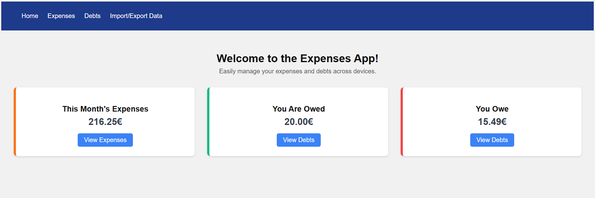
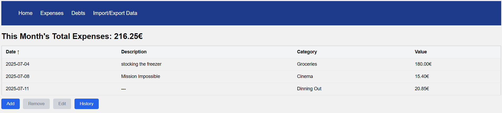
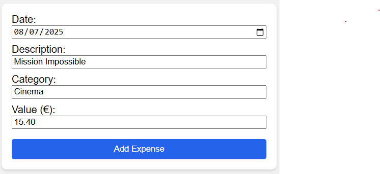
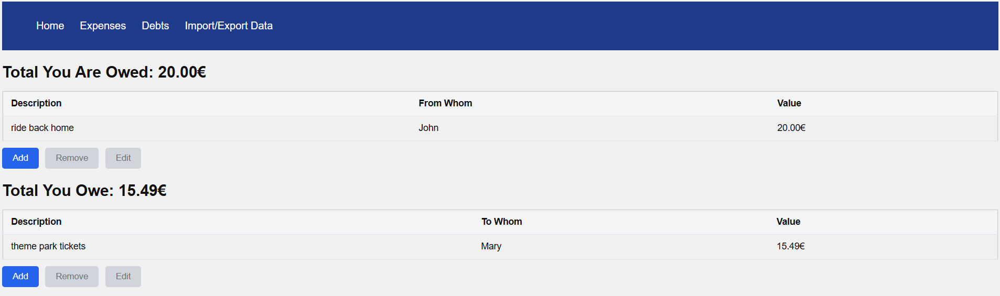
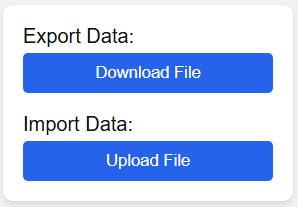

# 💸 Expenses App

A simple and intuitive web application to help you **track expenses and debts**, visualize your monthly balances, and back up or restore your data easily.

## 🚀 Features

- 📅 Track **monthly expenses** with:
  - Date, description, category, and value
- 🤝 Manage **debts** with:
  - "You owe" and "Owed to you" sections
- ✏️ **Add**, **edit**, and **delete** entries from expenses or debts
- 📈 View **monthly totals** and history of past expenses
- 💾 **Backup** and **restore** all your data in JSON format
- 🖱️ Clean and responsive UI with consistent styling

## 🛠️ Technologies Used

- **React**
- **React Router DOM**
- **Local Storage** for persistence
- **Custom context providers** for expenses and debts
- **Modular CSS** for clean, reusable styles

## Installation

1. Clone the repository:
   ```bash
   git clone https://github.com/JoaoMLViegas/expenses-app.git
   cd expenses-app
   ```
2. Install dependencies:
   ```bash
   npm install
   ```
3. Run the app:
   ```bash
   npm run dev
   ```
4. Open http://localhost:5173

## Live Demo & Preview

Try the app live here:  
[https://JoaoMLViegas.github.io/expenses-app](https://JoaoMLViegas.github.io/expenses-app)

Here are some screenshots to give you a quick look at the app:











## Deployment

To deploy your own version on GitHub Pages:

1. Set `"homepage"` in `package.json` to your GitHub Pages URL.

2. Run:

   ```bash
   npm run build
   npm run deploy
   ```

3. Your app will be available on your GitHub Pages URL.

_Note:_ This app uses React Router's **HashRouter** for GitHub Pages compatibility.
